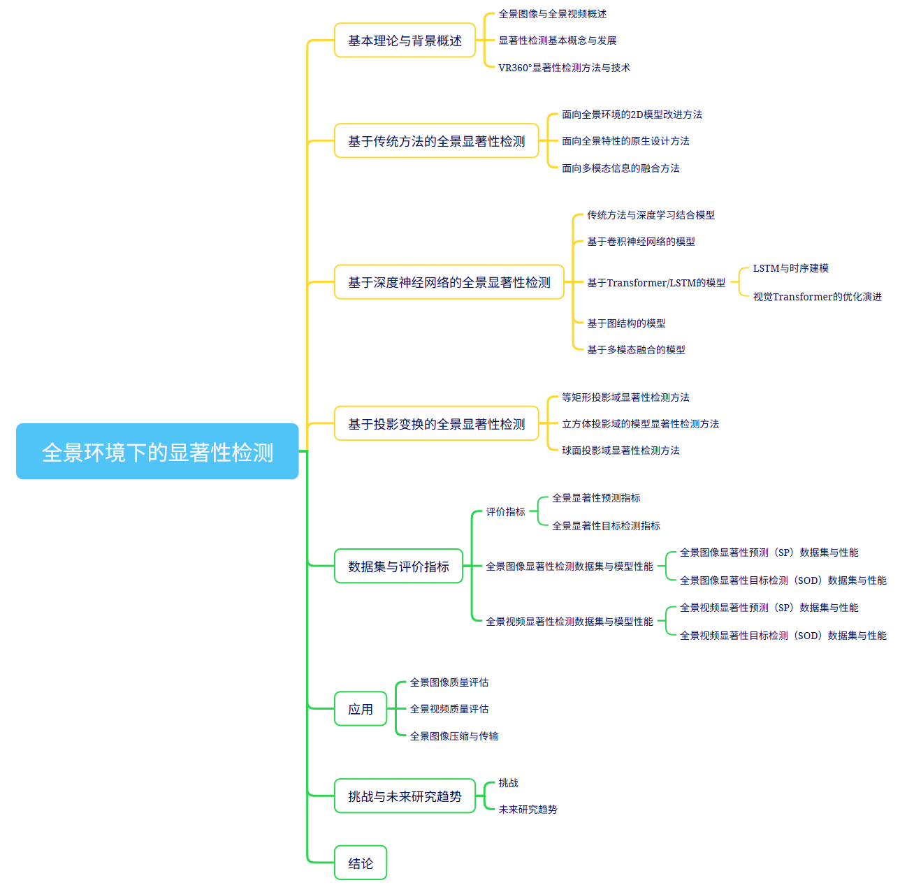

# 全景视觉显著性检测（Panoramic Visual Saliency Detection）

## 引言
全景图像（ODI）数据具有360°×180°的视场范围，凭借其沉浸式体验优势，已在医疗、教育、娱乐等领域获得广泛关注。本综述系统梳理了2017-2025年深度学习技术在全景视觉显著性检测领域的最新进展，涵盖CNN、Transformer、LSTM等架构及多投影域建模方法。
我们创建此开源仓库，旨在为综述中提及的所有工作提供分类整理与代码链接，方便研究者快速追踪该领域的技术演进。我们将持续更新此仓库，尽可能收录最新研究成果，以期为全景视觉研究提供参考，并促进该领域研究社区的交流与发展。
## 全景图像（ODI）
### 1. 显著性预测(SP)
#### 传统方法
- **A novel superpixel-based saliency detection model for 360-degree images**  [Paper](https://www.sciencedirect.com/science/article/pii/S0923596518307379)（2018）
- **A saliency prediction model on 360 degree images using color dictionary based sparse representation**  [Paper](https://www.sciencedirect.com/science/article/pii/S0923596518302418)（2018）
- **GBVS360, BMS360, ProSal: Extending existing saliency prediction models from 2D to omnidirectional images**  [Paper](https://www.sciencedirect.com/science/article/pii/S0923596518302406)（2018）
- **Depth-based saliency estimation for omnidirectional images**  [Paper](https://library.imaging.org/ei/articles/31/11/art00022)（2019）
#### 深度学习方法
- **Saliency in VR: How do people explore virtual environments?**  [Paper](https://ieeexplore.ieee.org/abstract/document/8269807/) [Code](https://github.com/vsitzmann/vr-saliency)（2018）
- **SalNet360: Saliency Maps for omni-directional images with CNN**  [Paper](https://www.sciencedirect.com/science/article/pii/S0923596518304685)（2018）
- **A Content-Based Approach for Saliency Estimation in 360 Images**  [Paper](https://ieeexplore.ieee.org/abstract/document/8803296)（2018）
- **Panoramic convolutions for 360o single-image saliency prediction**  [Paper](http://graphics.unizar.es/papers/Martin-VR-Saliency-2020.pdf)（2020）
- **SalBiNet360: Saliency Prediction on 360° Images with Local-Global Bifurcated Deep Network**  [Paper](https://ieeexplore.ieee.org/abstract/document/9089519/) [Code](https://github.com/githubcbob/SalBiNet360)（2020）
- **SalGCN: Saliency Prediction for 360-Degree ImagesBased on Spherical Graph**  [Paper](https://dl.acm.org/doi/abs/10.1145/3394171.3413733)（2020）
- **Dilated Convolutional Neural Networks for Panoramic Image Saliency Prediction**  [Paper](https://ieeexplore.ieee.org/abstract/document/9053888/)（2020）
- **A Multi-FoV Viewport-based Visual Saliency Model Using Adaptive Weighting Losses for 360 Images**  [Paper](https://ieeexplore.ieee.org/abstract/document/9122430/) [Code](https://github.com/FannyChao/MV-SalGAN360)（2021）
- **Saliency Prediction on Omnidirectional Images with Generative Adversarial Imitation Learning**  [Paper](https://ieeexplore.ieee.org/abstract/document/9328187/) [Code](https://github.com/yanglixiaoshen/SalGAIL)（2021）
- **Rethinking 360° Image Visual Attention Modelling with Unsupervised Learning**  [Paper](http://openaccess.thecvf.com/content/ICCV2021/html/Djilali_Rethinking_360deg_Image_Visual_Attention_Modelling_With_Unsupervised_Learning._ICCV_2021_paper.html) [Code](https://github.com/yanglixiaoshen/SalGAIL)（2021）
- **360-degree visual saliency detection based on fast-mapped convolution and adaptive equator-bias perception**  [Paper](https://link.springer.com/article/10.1007/s00371-021-02395-w)（2023）
- **360-degree visual saliency detection based on fast-mapped convolution and adaptive equator-bias perception**  [Paper](https://www.sciencedirect.com/science/article/pii/S1051200421003286)（2022）
- **Hierarchical Bayesian LSTM for Head Trajectory Prediction on Omnidirectional Images**  [Paper](https://ieeexplore.ieee.org/abstract/document/9556612/)（2021）
- **From Haziness to Clarity: A Novel Iterative Memory-Retrospective Emergence Model for Omnidirectional Image Saliency Prediction**  [Paper](https://ieeexplore.ieee.org/abstract/document/11045255/)（2025）
- **Multi-scale graph feature extraction network for panoramic image saliency detection**   [Paper](https://link.springer.com/article/10.1007/s00371-023-02825-x)

### 2. 显著性目标检测(SOD)
#### 传统方法
- **Automatic Salient Object Detection for Panoramic Images Using Region Growing and Fixation Prediction Model**  [Paper](https://arxiv.org/abs/1710.04071)（2018）
#### 深度学习方法
- **Distortion-adaptive Salient Object Detection in 360 Omnidirectional Images**  [Paper](https://ieeexplore.ieee.org/abstract/document/8926489/) [Code](https://pan.baidu.com/s/1o1jkdMMWMr-TQFIERCtwng?pwd=imqc)（2019）
- **FANet: Features Adaptation Network for 360◦ Omnidirectional Salient Object Detection**  [Paper](https://ieeexplore.ieee.org/abstract/document/9211754/) [Code](https://github.com/DreaMKHuang/FANet.git)（2020）
- **Stage-wise Salient Object Detection in 360° Omnidirectional Image via Object-level Semantical Saliency Ranking**  [Paper](https://ieeexplore.ieee.org/abstract/document/9199564/) [Code](https://github.com/360-SSOD/download/tree/main)（2020）
- **Multi-Projection Fusion and Refinement Network for Salient Object Detection in 360 Omnidirectional Image**  [Paper](https://ieeexplore.ieee.org/abstract/document/10012430/)（2023）
- **View-aware Salient Object Detection for 360° Omnidirectional Image**  [Paper](https://ieeexplore.ieee.org/abstract/document/9900475/)（2022）
- **Channel-Spatial Mutual Attention Network for 360° Salient Object Detection**  [Paper](https://ieeexplore.ieee.org/abstract/document/9956354/) [Code](https://github.com/YeeZ93/CSMA-Net)（2022）
- **Consistency perception network for 360◦  omnidirectional salient object detection**  [Paper](https://www.sciencedirect.com/science/article/abs/pii/S0925231224020149)（2025）
- **Breaking the Dataset Shackles: Data-Efficient Learning with Mamba Network for 360° Salient Object Detection**   [Paper](https://iopscience.iop.org/article/10.1088/1742-6596/3072/1/012004/meta)（2025）
### 3. 扫视路径
- **ScanGAN360: A Generative Model of Realistic Scanpaths for 360◦ Images**  [Paper](https://ieeexplore.ieee.org/abstract/document/9714046/) （2022）

## 全景视频（ODV）
### 1. 显著性预测(SP)
#### 深度学习方法
- **Your Attention is Unique: Detecting 360-Degree Video Saliency in Head-Mounted Display for Head Movement Prediction**  [Paper](https://dl.acm.org/doi/abs/10.1145/3240508.3240669) [Code](https://github.com/phananh1010/PanoSalNet)（2018）
- **Saliency Detection in 360◦ Videos**  [Paper](http://openaccess.thecvf.com/content_ECCV_2018/html/Ziheng_Zhang_Saliency_Detection_in_ECCV_2018_paper.html) [Code](https://github.com/xuyanyu-shh/Saliency-detection-in-360-video)（2018）
- **Cube Padding for Weakly-Supervised Saliency Prediction in 360 Videos**  [Paper](http://openaccess.thecvf.com/content_cvpr_2018/html/Cheng_Cube_Padding_for_CVPR_2018_paper.html) [Code](https://github.com/hsientzucheng/CP-360-Weakly-Supervised-Saliency)（2018）
- **Predicting Head Movement in Panoramic Video: A Deep Reinforcement Learning Approach**  [Paper](https://ieeexplore.ieee.org/abstract/document/8418756/) [Code](https://github.com/YuhangSong/DHP)（2018）
- **Saliency Prediction for 360-degree Video**  [Paper](https://ieeexplore.ieee.org/abstract/document/9303135/)（2020）
- **Towards Audio-Visual Saliency Prediction for Omnidirectional Video with Spatial Audio**  [Paper](https://ieeexplore.ieee.org/abstract/document/9301766/)（2020）
- **ATSal: An Attention Based Architecture for Saliency Prediction in 360◦  Videos**  [Paper](https://link.springer.com/chapter/10.1007/978-3-030-68796-0_22) [Code](https://github.com/mtliba/ATSal)（2020）
- **Viewport-dependent Saliency Prediction in 360° Video**  [Paper](https://ieeexplore.ieee.org/abstract/document/9072511/)（2020）
- **2D-Based Saliency Prediction Framework for Omnidirectional−360◦ Video**  [Paper](https://ieeexplore.ieee.org/abstract/document/9568999/)（2021）
- **Panoramic Vision Transformer for Saliency Detection in 360◦  Videos**  [Paper](https://link.springer.com/chapter/10.1007/978-3-031-19833-5_25) [Code](https://github.com/HS-YN/PAVER)（2022）
- **Spherical Convolution Empowered Viewport Prediction in 360 Video Multicast with Limited FoV Feedback**  [Paper]([https://ieeexplore.ieee.org/abstract/document/9568999/](https://dl.acm.org/doi/abs/10.1145/3511603))（2023）
- **Spherical Vision Transformers for Audio-Visual Saliency Prediction in 360→ Videos**  [Paper](https://ieeexplore.ieee.org/abstract/document/11144923) [Code](https://cyberiada.github.io/SalViT360/)
- **CASP: Consistency-aware Audio-induced Saliency Prediction Model for Omnidirectional Video**  [Paper](https://openaccess.thecvf.com/content/CVPR2025/html/Wan_CASP_Consistency-aware_Audio-induced_Saliency_Prediction_Model_for_Omnidirectional_Video_CVPR_2025_paper.html)（2025）
### 2. 显著性目标检测(SOD)
- **Instance-Level Panoramic Audio-Visual Saliency Detection and Ranking**  [Paper](https://dl.acm.org/doi/abs/10.1145/3664647.3681070)
- **PAV-SOD: A New Task towards Panoramic Audio visual Saliency Detection**  [Paper](https://dl.acm.org/doi/abs/10.1145/3565267)

## 全景显著性检测数据集
### 显著性预测(SP)数据集
#### 全景图像（ODI）
- **Saliency in VR** [dataset](https://drive.google.com/file/d/1BHtigR_egB6E-N4irZA9wSAH_902_PBh/view?usp=sharing)
- **AOI** [dataset](https://github.com/yanglixiaoshen/SalGAIL)
#### 全景视频（ODV）
- **360saliency** [dataset,code:p0a5](https://pan.baidu.com/s/18equcFntAomwEEP3TgHhFw)
- **Wild-360** [dataset](https://aliensunmin.github.io/project/360saliency/)
- **PVS-HMEM** [dataset](https://github.com/YuhangSong/DHP)
### 显著性目标检测(SOD)数据集
#### 全景图像（ODI）
- **360-SOD** [dataset](https://pan.baidu.com/s/1r6KJfRLxEFN3DzJjvNKT1g?pwd=ps1d)
- **360-SSOD** [dataset](https://github.com/360-SSOD/download/tree/main)
- **ODI-SOD** [dataset](https://github.com/iCVTEAM/ODI-SOD)
#### 全景视频（ODV）
- **PAV-SOD** [dataset](https://github.com/ZHANG-Jun-Pu/PAV-SOD)
